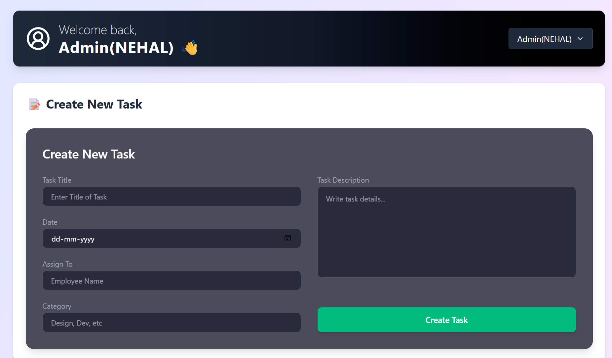
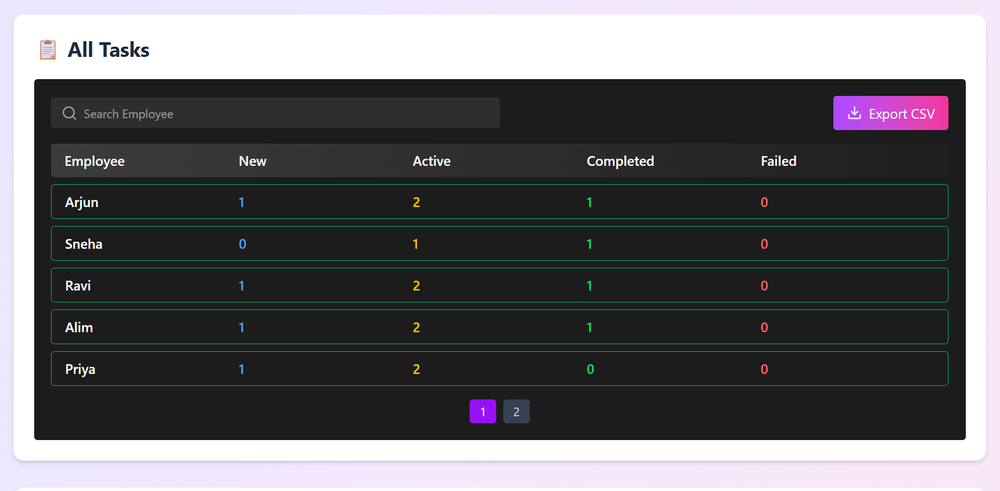
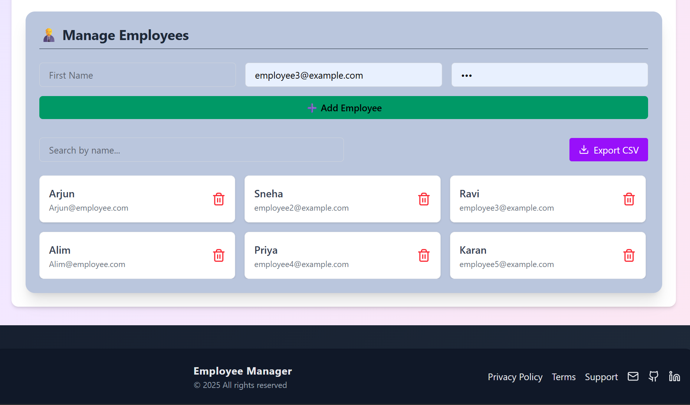

# Employee Management System 🧑‍💼


A modern and responsive Employee Management System built using **React**, **Tailwind CSS**, and **Framer Motion**.  
This project is fully open source under the [MIT License](LICENSE).

---

## 🚀 Features

- 👨‍💼 **Admin Dashboard**
  - Add/Delete Employees
  - Assign Tasks
  - View All Tasks (filter/sort/export)
- 👨‍🔧 **Employee Dashboard**
  - View tasks
  - Accept, Reject, Complete, or Fail tasks
  - Task summaries with live updates
- 🌙 Dark mode UI
- ⚡ Fast and smooth with Vite
- 🎨 Beautiful animations via Framer Motion
- 📦 LocalStorage persistence

---

## 🛠️ Tech Stack

- [React.js](https://reactjs.org/)
- [Tailwind CSS](https://tailwindcss.com/)
- [Framer Motion](https://www.framer.com/motion/)
- [Lucide Icons](https://lucide.dev/)
- [Vite](https://vitejs.dev/)

---

## 📁 Folder Structure

src/
│
├── components/
│ ├── Auth/
│ ├── Dashboard/
│ ├── Tasklist/
│ └── other/
│
├── context/
│ └── AuthProvider.jsx
├── utils/
│ └── localStorage.jsx
├── App.jsx
├── main.jsx


---

Getting Started

```bash
# Clone the repo
git clone https://github.com/Nehalshaikh8698/Employee-Management-System.git

# Install dependencies
npm install

# Run locally
npm run dev

##LOGIN SS


##ADMIN DASHBOARD SS(here we assign new task to employee)



##Summary of All employee SS



##Here We Can Create or Delete Employee


##Employee Dashboard SS
[alt text](image-4.png)

🔓 License
This project is open source under the MIT License.
Feel free to fork, use, and contribute!

👤 Author
Made with ❤️ by @Nehalshaikh8698

🌐 Deployment
Coming soon: Live version on Vercel or similar.